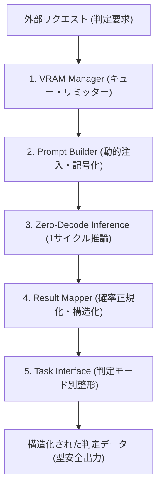

# 基本設計書（ハイレベル・アーキテクチャ機能概要）
**JEV (Judge & Evaluation via Vectorized-logits) ローカル高速判定システム**

| 項目 | 内容 |
| :--- | :--- |
| 文書番号 | JEV-BD-001 |
| ドキュメント名 | JEV ローカル高速判定システム 基本設計書 |
| 版数 | Rev.1.1 (機能概要中心への改訂) |
| 改訂日 | 2026-09-20 |
| 作成日 | 2026-09-20 |
| 作成者 | JEV Architecture Team |

---

## 1. システム概要とハイレベル・コンセプト

### 1.1 システムの存在意義
本システム（自家製Jev）は、テキスト（文章）を一切生成せず、外部システムからの要求に対して**「超高速な判断」**と**「構造化された確率データ」**のみを返すことに特化した判定基盤です。

従来の生成AI（LLM-as-a-Judge等）は「思考し、文章を書き、それを人間や正規表現がパースする」という方式をとっていたため、推論遅延の大きさ、KVキャッシュ肥大化によるVRAM枯渇、出力フォーマットの破損やゆらぎが不可避でした。

本システムは、**「文字列をパースして考える機能」と「AIの計算機能」を完全に分離** します。文章生成能力を封印し、ニューラルネットワークを純粋な「確率計算機」としてのみ動作させることで、**プログラムの条件分岐（if文）にそのまま組み込める、高速で信頼性の高いAIパーツ** を提供します。

### 1.2 理論的裏付け（主要諸元・研究アプローチ）
本システムのアーキテクチャは、以下の3つの研究アプローチを組み合わせて構築されています。

1. **出力の強制とLogitマスキングの理論（Guided Generation）**
   - **論文名**: Efficient Guided Generation for Large Language Models
   - **著者**: Brandon T. Willard, Rémi Louf (2023)
   - **概要 / URL**: [arXiv:2307.09702](https://arxiv.org/abs/2307.09702)
   - **適用方針**: 対象となるトークン（語彙）以外を計算空間から数学的に除外。指定された型や記号以外の出力を確率0として排除し、目的のシグナルのみを抽出します。
2. **生成を伴わない判定特化モデルの構造的優位性（Encoder-Only）**
   - **論文名**: DeBERTaV3: Improving DeBERTa using ELECTRA-Style Pre-Training with Gradient-Disentangled Embedding Sharing
   - **著者**: Pengcheng He, Jianfeng Gao, Weizhu Chen (Microsoft, 2021/2023)
   - **概要 / URL**: [arXiv:2111.09543](https://arxiv.org/abs/2111.09543)
   - **適用方針**: 文章生成を行わない判定において、双方向エンコードに特化した構造を活用。後方トークンの自己回帰計算やKVキャッシュメモリを排除し、省VRAMと高精度な理解を両立します。
3. **LLMを判定器として使う際のプロンプト設計とバイアス排除（LLM-as-a-Judge）**
   - **論文名**: Judging LLM-as-a-Judge with MT-Bench and Chatbot Arena
   - **著者**: Lianmin Zheng, et al. (UC Berkeley, 2023)
   - **概要 / URL**: [arXiv:2306.05685](https://arxiv.org/abs/2306.05685)
   - **適用方針**: 判定器特有の「位置バイアス（最初の選択肢を選びやすい）」や「冗長性バイアス」を排除するプロンプト注入およびスワップ評価基準を定義します。

> **設計上の補足 (OSS活用方針):**  
> 論文1（Willard & Louf）のFSMに基づくLogitマスキング・語彙強制は、著者らが公開しているOSSである **`outlines`** や **`guidance`** を推論エンジン裏側のアダプターとして利用することで、特定トークンIDのLogit抽出を型安全に代行させることが可能です。

### 1.3 全体データフロー (Mermaid アーキテクチャ図)

---

## 2. 5大機能ブロック（ハイレベル機能概要）

本システムは、責務が明確に分離された以下の5つの機能ブロックで構成されます。

### 2.1 判定インターフェース機能（タスク制御: Task Interface）
呼び出し元（クライアントシステム）の目的に合わせて、4つの判定モードを提供します。

| 判定モード | 機能概要 | 入力例と出力データ |
| :--- | :--- | :--- |
| **Noul（真偽判定）** | 提示されたルールに対して「Yes / No」の確率（確信度）を返します。 | 入力: 「このログは不正アクセスか？」 出力: `{"label": "Yes", "confidence": 0.94}` |
| **Choice（単一選択）** | 用意された複数の選択肢（A, B, C...）から、最も確率の高いものを1つ選びます。 | 入力: 「カテゴリ分類（技術, 営業, 経理）」 出力: `{"selected": "A", "label": "技術", "probs": {...}}` |
| **Score（段階評価）** | 1〜5などの段階評価に対し、確率の分布を計算して高精度な期待値スコアを返します。 | 入力: 「回答の品質を1〜5で評価」 出力: `{"score": 3.82, "distribution": [0.05, 0.1, 0.2, 0.45, 0.2]}` |
| **Multi-Label（複数選択）** | 複数のラベルそれぞれに対して独立した確率（0〜100%）を算出し、閾値を超えたものをすべて抽出します。 | 入力: 「該当するトピックを抽出」 出力: `{"matches": ["セキュリティ", "ネットワーク"]}` |

### 2.2 動的コンテキスト注入機能（Prompt Builder）
システムが未知のデータや新しいルールに適応するための前処理を担います。

- **ルールの動的バインド**: 判定基準（例：「サイバー攻撃の定義」「有害性のしきい値」など）をプログラム内にハードコードせず、リクエストごとに外部から動的にプロンプトテンプレートへ注入します。
- **ラベルの記号化**: 複雑なラベル名（例: 「極めて重大なインシデント」）を、AIが処理しやすい単一の記号（A, B, C...）に自動マッピングし、トークナイズのブレや多重トークン分割による判定誤差を防ぎます。
- **思考モデル向け事前完了制御（Prompt Prefill）**: 対象モデルが思考機能（Thinking / CoT）を持つ場合、モデル応答の先頭に思考完了タグを事前注入することで、思考文の生成ループをスキップさせ、1サイクル推論を維持します。

### 2.3 高速推論エンジン（Zero-Decode Inference）
AIモデル（LLM）の文章生成能力を封印し、「計算機」としてのみ機能させる心臓部です。

- **1サイクル推論**: 文章を1文字ずつ組み立てる処理（デコードループ）を完全にスキップし、入力を1回読み込ませるだけの処理（順伝播 / Forwardパス）で完結させます。これにより、一般的な生成AIの数十倍の応答速度（ミリ秒単位）を実現します。
- **特定シグナル抽出**: AIが次に出力しようとした無数の語彙候補から、事前に指定された記号（Yes, No, A, Bなど）の内部数値（Logit）だけをピンポイントで抽出します。

### 2.4 確率計算と構造化機能（Result Mapper）
AIの生の出力数値（Logit）を、人間や別プログラムが扱いやすい型安全なデータに変換します。

- **確率の正規化**: 生の数値（Logit）を、排他的な選択には Softmax関数（全体で合計100%）、独立した判定には Sigmoid関数（個別に0〜100%）を用いて、正確な確率（％）に数学的変換します。
- **型安全の保証**: 変換した確率データと判定結果を、必ず決められた厳密なスキーマ（JSONまたは専用データオブジェクト）に格納して返します。AI特有の「余計な前置きや文章が混じるエラー」を構造的・数学的に100%排除します。

### 2.5 ローカルリソース保護機能（VRAM Manager）
単一GPUなどの限られたローカル環境でも、システムをクラッシュさせずに安定稼働させるための制御機能です。

- **直列キューイング（シーケンシャル制御）**: 複数の判定リクエストが同時に到来しても、無秩序な並列実行を行わず1件ずつ順番にさばくことで、VRAMメモリの瞬間的な枯渇（OOM: Out Of Memory）を確実に防止します。
- **トークン長リミッター**: 処理能力を超える長文データが送られてきた場合、推論エンジンに渡す前段で即座に検知して弾き（あるいは安全にトランケートし）、システム全体のフリーズを未然に防ぎます。

---

## 3. 動作前提およびシステム境界

### 3.1 実行前提環境
- **対応OS**: Windows 11 / Linux (Ubuntu 22.04+)
- **推論ハードウェア**: ローカルGPU (CUDA対応, VRAM 4GB〜12GB推奨) または CPU
- **ランタイム**: Python 3.11+ (`uv` 仮想環境)

### 3.2 システム境界と安全契約
- **完全決定論的出力契約**: 入力テキストとモデル重みが同一である場合、温度パラメータを0に固定し、常に同一の確率値・スコアを出力します。
- **非破壊・安全縮退**: トークン長オーバーフローや未定義ラベルなどの異常リクエストを受信した場合、推論エンジンを異常終了させず、適切なエラー理由を含む型安全なレスポンスを返却します。

---

## 4. 改訂履歴 (Change Log)

| 版数 | 改訂日 | 変更者 | 変更内容・変更理由 (Why) |
| :--- | :--- | :--- | :--- |
| Rev.1.0 | 2026-09-20 | JEV Architecture Team | 新規作成（初版制定：諸元論文に基づく基本設計の策定） |
| Rev.1.1 | 2026-09-20 | JEV Architecture Team | 機能概要（ハイレベル・アーキテクチャ）への視点引き上げ。5大機能ブロック（Task Interface, Prompt Builder, Zero-Decode Inference, Result Mapper, VRAM Manager）の体系化。 |
