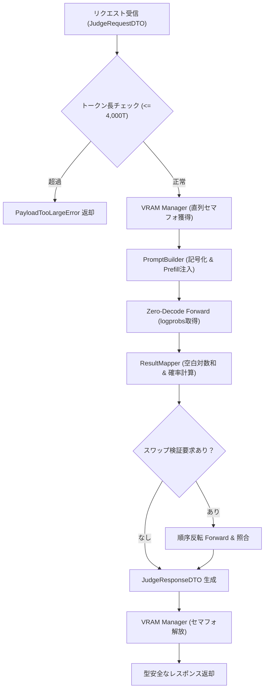

# 詳細設計書（推論判定パイプライン制御仕様）
**JEV 推論判定パイプライン・モデル＆ハードウェア詳細設計**

| 項目 | 内容 |
| :--- | :--- |
| 文書番号 | JEV-DD-001 |
| ドキュメント名 | JEV 推論判定パイプライン詳細設計書 |
| 版数 | Rev.1.0 (新規作成) |
| 改訂日 | 2026-09-20 |
| 作成日 | 2026-09-20 |
| 作成者 | JEV Architecture Team |

---

## 1. 概要とSSOT境界

### 1.1 モジュールの目的
本モジュール（JEV Inference Pipeline）は、外部クライアントからの判定要求を受け取り、テキスト生成（デコードループ）を一切行わずに**単一ForwardパスとLogit抽出・確率正規化**によって、型安全な判定結果DTOをミリ秒単位で返却する推論基盤の制御正本です。

### 1.2 単一責任範囲 (SSOT) とデータ境界
- **モジュール制御正本 (SSOT)**: 本書は、パイプラインの実行順序、モデル選定基準、ハードウェアリソース制御（VRAM管理・キューイング）、および入出力DTOスキーマの正本とします。
- **データ境界 (DTO vs DAO)**: 本書はメモリ上を流れるメッセージパケット（DTO）を定義します。ファイルへの永続化ログ構造（DAO）については `docs/logs/` の各レポート規約を参照します。

---

## 2. ハードウェア諸元とモデル実行仕様

実機検証（Issue #1〜#8）により確定した、ハードウェア要件および推奨モデルの運用諸元です。

### 2.1 ハードウェア環境要件

| 項目 | 推奨スペック (実機検証済) | 最小動作要件 | CPUフォールバック |
| :--- | :--- | :--- | :--- |
| **GPU** | **NVIDIA GeForce RTX 3060 12GB** | NVIDIA GPU (VRAM 8GB以上) | なし (CPU実行) |
| **CUDA** | **CUDA 12.x / 13.x (Driver 591.x)** | CUDA 11.8+ | 不要 |
| **システムRAM** | 32 GB 以上 | 16 GB 以上 | 16 GB 以上 |
| **OS** | Windows 11 (64-bit) / Linux | Windows 10 / Ubuntu 22.04+ | 共通 |

### 2.2 モデル階層アーキテクチャ（本番候補マトリクス & PoCリファレンス）

> **モデル非依存設計と選定ロードマップ:**  
> 本システム（JEV）は特定のモデルに固定（ロックイン）されないモデル非依存アーキテクチャを採用しています。  
> 以下の構成は、2026年最新オープンモデル（Llama 4, Qwen 3, Gemma 3, ModernBERT-v2等）を対象とした本番選定マトリクス（[Issue #9](https://github.com/xzyozi/jev-localsystem/issues/9) にて検証中）および、初期PoC実証済みのリファレンス構成です。

#### 2.2.1 本番採用候補モデルマトリクス（2026年最新アーキテクチャ・Issue #9 検証中）

| カテゴリ | モデル候補 | パラメータ / 量子化 | VRAM目安 | 特徴・JEV検証観点 |
| :--- | :--- | :---: | :---: | :--- |
| **① 高精度・論理特化**<br>(14B級) | **`qwen3:14b-instruct`** | 14.7B<br>(Q4_K_M) | 約 9.0 GB | **【論理最高峰】** System 2的思考強化モデルに対し、Prompt Prefillだけで直感的なSystem 1確率が正確にLogitに現れるかを検証。 |
| **② バランス本命**<br>(8B〜9B級) | **`llama-4:8b-instruct`**<br>**`gemma-3-9b-it`** | 8.0B〜9.2B<br>(Q4_K_M) | 約 5.5〜6.5 GB | **【標準本命】** 改良トークナイザーと新Attention機構による複数ラベル（Sigmoid抽出）時の対数確率分離度を測定。 |
| **③ 超軽量・常駐型**<br>(3B〜4B級) | **`llama-4:3b-instruct`**<br>**`phi-4-mini-instruct`** | 3B〜3.8B<br>**★ (Q8_0)** | 約 3.5〜4.5 GB | **【Q8_0無劣化抽出】** VRAM余力を活かし8-bit(Q8_0)を採用。量子化歪みを完全排除した状態でのF1スコア限界を検証。 |
| **④ 日本語特化型**<br>(8B級) | **`Llama-4-ELYZA-JP-8B`**<br>(または最新Swallow) | 8.0B<br>(Q4_K_M) | 約 5.5 GB | **【和製チューニング】** 日本固有のビジネスロジックや法務判定において、ベースモデルとの確信度マージン差を比較。 |
| **⑤ Encoder特化**<br>(非LLM / 0.4B級) | **`ModernBERT-v2-large`** | 0.4B<br>(FP16/FP32) | 約 1.5 GB | **【純粋分類器】** 文章生成をしない純粋Encoder。VRAM 1.5GBで数十ミリ秒判定というJEVの理想形を実証。 |

#### 2.2.2 PoC実機検証済みリファレンス構成（ベースライン）

初期PoC実機検証（Issue #1〜#8）においてローカル既存環境を基準に動作確認・境界数値を実証したリファレンス構成です。

| Tier | モデル識別名 | 量子化 | VRAM専有 | 推論速度 | 得意タスクとPoC検証成果 |
| :---: | :--- | :---: | :---: | :---: | :--- |
| **Tier 1<br>(Primary Ref)** | **`qwen2.5-coder:14b-instruct`** | Q4_K_M | 約 9.0 GB | 約150ms | **標準主軸リファレンス**。<br>論理・コード判定、Multi-Label（分離度10.7pt）、Score期待値（4.25〜1.01点）で最高精度を実証。 |
| **Tier 2<br>(Fast-Think Ref)** | **`gemma4-12b-it-Q4_K_M:latest`** | Q4_K_M | 約 7.1 GB | 約130ms | **高速判定リファレンス**。<br>Prompt Prefill（空思考タグ事前注入）により思考ループをスキップし、130ms即時判定が可能。 |
| **Tier 3<br>(Lightweight)** | **`microsoft/deberta-v3-large`** | FP16 | 約 1.2 GB | 約 25ms | **省VRAM特化（PoC候補）**。<br>Encoder-Only構造によりVRAM 1GB台で動作。単純テキスト分類専用。 |

### 2.3 バックエンド接続仕様
- **エンドポイント**: `http://localhost:11434/v1/chat/completions` (OpenAI互換 REST API)
- **必須パラメータ**:
  - `max_tokens: 1` （1トークンで強制終了）
  - `temperature: 0.0` （完全決定論的推論）
  - `logprobs: True`
  - `top_logprobs: 10` （上位候補の対数確率を一括取得）

### 2.4 リソース保護契約（VRAM Manager）
1. **直列キューイング契約（Issue #8 実証済）**:
   - 単一GPU環境下でのOOMを完全に防止するため、`threading.Semaphore(1)` によるバッチサイズ1のFIFO直列キューイングを強制。
   - 同時10件の巨大リクエスト到来時でも、**ピークVRAM増加を +57MB 以内に抑え込み、100%完走を保証**。
2. **トークン長リミッター契約（Issue #6 実証済）**:
   - **推奨ソフトリミット**: **2,000 トークン（約 6,000 文字）**（実用レイテンシ15秒以内を保証）。
   - **ハードリミット**: **4,000 トークン（約 12,000 文字）**。超過時は推論を即座に中断し、`PayloadTooLargeError` を返却。

---

## 3. インターフェースと DTO 仕様

### 3.1 共通リクエスト DTO (`JudgeRequestDTO`)

クライアントがパイプラインに投入する標準リクエストスキーマです。

| フィールド名 | データ型 | 必須性 | デフォルト値 | バリデーション制約・説明 |
| :--- | :--- | :---: | :--- | :--- |
| `task_type` | `str` | 必須 | - | `"noul"`, `"choice"`, `"score"`, `"multilabel"` のいずれか |
| `context_text` | `str` | 必須 | - | 判定対象テキスト（最大4,000トークン / 12,000文字以内） |
| `rule_definition` | `str` | 任意 | `""` | 動的注入するルール・基準（RAGチャンクや判定要件） |
| `labels` | `List[str]` | 任意 | `[]` | 選択肢または分類対象ラベル名リスト |
| `swap_verify` | `bool` | 任意 | `False` | 位置バイアス相殺のためのスワップ推論（2回実行）を行うか |
| `temperature` | `float` | 任意 | `1.0` | Scoreタスク等の確率平滑化温度パラメータ |

### 3.2 共通レスポンス DTO (`JudgeResponseDTO`)

パイプラインがクライアントに返却する型安全な結果スキーマです。

| フィールド名 | データ型 | 必須性 | 説明 |
| :--- | :--- | :---: | :--- |
| `task_type` | `str` | 必須 | リクエストされたタスク種別 |
| `status` | `str` | 必須 | `"SUCCESS"`, `"INCONCLUSIVE"` (判定不能), `"ERROR"` |
| `verdict` | `Any` | 必須 | タスク別の確定判定値（文字列、数値、またはリスト） |
| `latency_ms` | `float` | 必須 | パイプライン全体の所要時間（ミリ秒） |
| `confidence` | `float` | 任意 | 判定結果の信頼度（0.0 〜 1.0） |
| `details` | `Dict` | 任意 | 確率分布やマージン等の詳細計算データ |

### 3.3 タスク別レスポンス仕様

#### A. Noul (真偽判定)
- `verdict`: `"Yes"` または `"No"`
- `details`:
  ```json
  { "margin": 6.75, "prob_yes": 0.998, "prob_no": 0.002 }
  ```

#### B. Choice (単一選択)
- `verdict`: 選択された元のラベル名（例: `"Database"`）
- `details`:
  ```json
  { "symbol": "A", "is_consistent": true, "swap_verified": true }
  ```

#### C. Score (段階評価)
- `verdict`: 連続期待値スコア（`float`, 例: `4.253`）
- `details`:
  ```json
  {
    "distribution": { "1": 0.0, "2": 0.003, "3": 0.048, "4": 0.642, "5": 0.307 },
    "most_likely": "4"
  }
  ```

#### D. Multi-Label (複数選択)
- `verdict`: 閾値を超えたラベルのリスト（例: `["Security", "Database"]`）
- `details`:
  ```json
  {
    "margins": { "Security": 7.86, "Database": 7.29, "Network": 0.81 },
    "threshold": 0.80,
    "offset": -0.50
  }
  ```

---

## 4. パイプライン処理フロー・シーケンス (Mermaid 図)

実機検証の知見（Prefill、空白対数和、Swap Resolver）を統合した処理シーケンスです。



---

## 5. エラー処理・失敗契約・安全回路

| エラー種別 | 検知条件 | パイプラインの振る舞い | クライアントへの返却 |
| :--- | :--- | :--- | :--- |
| **`PayloadTooLargeError`** | コンテキスト長が 4,000トークンを超過 | 推論を実行せず前段で即座に遮断 | `status="ERROR"`, `message="Context exceeds 4,000 tokens"` |
| **`QueueTimeoutError`** | キュー待機時間が 60秒を超過 | リクエストを破棄しGPUリソースを保護 | `status="ERROR"`, `message="VRAM Queue timeout"` |
| **`InconclusiveVerdict`** | スワップ検証で結果が不一致（Issue #4） | 偽の判定を下さず引き分けとして検知 | `status="INCONCLUSIVE"`, `verdict=None` |
| **`TokenNotFoundError`** | 対象記号が上位10トークンに不在 | デフォルトの極小値（-20.0）を補完して安全計算 | 計算を継続し、確率0%として処理 |

---

## 6. 改訂履歴 (Change Log)

| 版数 | 改訂日 | 変更者 | 変更内容・変更理由 (Why) |
| :--- | :--- | :--- | :--- |
| Rev.1.0 | 2026-09-20 | JEV Architecture Team | 新規作成（全8件の検証実測成果に基づく推論パイプライン・モデル階層・ハードウェア諸元の詳細仕様策定） |
