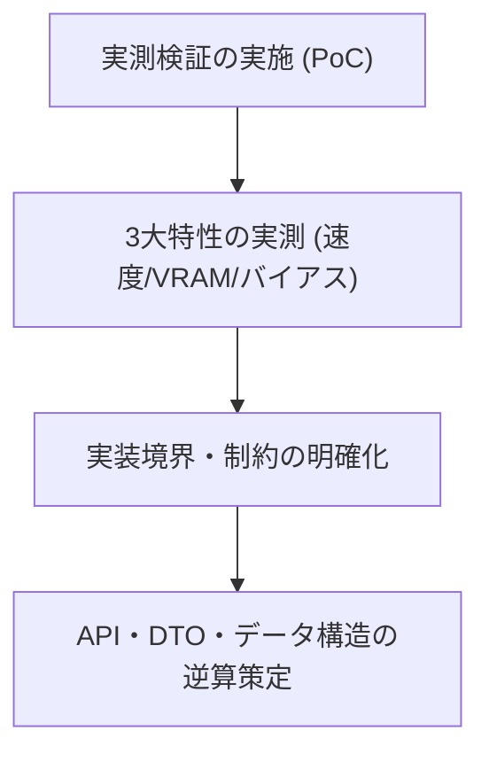

# 検証方法設計書（PoC・モデル境界評価計画）
**JEV 汎用判定基盤：モデル挙動・境界実測プロトコル**

| 項目 | 内容 |
| :--- | :--- |
| 文書番号 | JEV-TEST-001 |
| ドキュメント名 | JEV 検証方法設計書 |
| 版数 | Rev.1.0 (新規作成) |
| 改訂日 | 2026-09-20 |
| 作成日 | 2026-09-20 |
| 作成者 | JEV Architecture Team |

---

## 1. 検証の目的と基本アプローチ

### 1.1 検証目的（逆算型アプローチ）
本汎用基盤は、データ構造やAPIインターフェースを事前に固定化せず、**実測検証を通じて判明したモデル挙動と実装境界の制約から逆算して正式な仕様（DD/DS）を決定** します。

本検証フェーズでは、文章生成ループを行わない「Logit抽出方式」が実際にどの程度の速度・メモリ効率・判定安定性を持つのかを、以下の2つの異なる構造を持つモデルで直接比較・実測します。



### 1.2 解消すべき不確実性（Uncertainties）
1. **Logit抽出の安定性**: プロンプト末尾の空白有無（`" Yes"` vs `"Yes"`）によってLogitがどれほど変動するか。
2. **計算リソースの差**: Encoder-Only（DeBERTa系）とDecoder（Qwen/Llama系）におけるレイテンシ（ms）およびVRAM消費の差。
3. **判定バイアス**: 判定タスクにおいて、選択肢の提示順序（A/B）による位置バイアスがどの程度発生し、スワップ検証（順序反転）で相殺可能か。

---

## 2. 検証対象モデルと実験環境

### 2.1 比較対象モデル

| モデル識別名 | アーキテクチャ | パラメータ規模 | 主な検証観点 |
| :--- | :--- | :--- | :--- |
| **Candidate-A: DeBERTa-v3**<br>(`microsoft/deberta-v3-base` または `large`) | **Encoder-Only**<br>(双方向アテンション) | 86M〜435M | ・超高速レイテンシ<br>・極小VRAM消費<br>・NLU分類スコアの安定性 |
| **Candidate-B: Qwen2.5 / Llama-3**<br>(`Qwen/Qwen2.5-1.5B-Instruct` 等) | **Decoder-Only**<br>(因果的アテンション) | 1.5B〜7B | ・世界知識・複雑な指示追従力<br>・単一Forward時の末尾Logit挙動<br>・プロンプト設計への敏感性 |

### 2.2 実験環境
- **OS**: Windows 11 (CUDA 12.x 搭載環境)
- **ランタイム**: Python 3.11+ (`uv` 仮想環境)
- **ライブラリ**: `torch`, `transformers`, `numpy`

---

## 3. 検証実験マトリクス（3つの実験プロトコル）

### 実験1: トークンIDバインドと空白正規化の検証
- **目的**: プロンプト末尾のトークナイズ挙動と、ターゲットトークン（Yes/No 等）のID整合性を確認する。
- **検証手順**:
  1. プロンプト末尾を空白あり（`"回答: "`）と空白なし（`"回答:"`）の2パターンで入力。
  2. ターゲット語彙（`"Yes"`, `" Yes"`, `"No"`, `" No"`）のトークンIDとLogit値を比較。
- **評価基準**:
  - 末尾の空白仕様とトークンIDが一意に対応し、Logitの逆転や不当な減衰が起きないこと。

### 実験2: レイテンシ・VRAM・スループットの実測比較
- **目的**: 従来の文章生成方式と、本システムの「単一Forward Logit抽出方式」の計算効率を実測比較する。
- **測定メトリクス**:
  - **1件あたり処理時間 (Latency)**: ms 単位（ウォームアップ後の平均値）
  - **最大消費VRAM (Peak VRAM)**: MB 単位（`torch.cuda.max_memory_allocated()`）
  - **バッチ推論スループット**: Batch Size = 1, 4, 8, 16 における秒間処理件数
- **比較対象**:
  - 従来方式: `.generate(max_new_tokens=16)` によるテキスト生成＋文字列パース
  - 本方式: 単一 `.forward()` による目的トークンLogit抽出

### 実験3: 位置バイアス（Position Bias）測定とスワップ効果
- **目的**: Zheng et al. (2023) に基づき、LLM-as-a-Judgeにおける位置バイアス（先頭の選択肢を選びやすい傾向）の発生度合いを測定する。
- **検証手順**:
  1. 比較評価プロンプト（「案Aと案Bのどちらが優れているか」）を作成。
  2. AとBの提示順序を入れ替えたプロンプトを作成（Swap推論）。
  3. 順方向と逆方向のLogit確率を測定し、反転率（Consistency Rate）を算出。
- **評価基準**:
  - 単一Forwardでも位置バイアスが発生するか、またスワップ平均化によって判定の整合性が担保できるかを確認。

---

## 4. 検証スクリプトのプロトタイプ構成

外部依存や複雑なフレームワークを排し、スタンドアロンで即座に実行・計測できる最小限のスクリプト群を配置します。

```text
scripts/
├── benchmark_logits.py       # 実験1・2: Logit抽出精度・レイテンシ・VRAM計測
└── verify_position_bias.py   # 実験3: 位置バイアス測定・スワップ検証
```

- **出力仕様**: 検証結果は Markdown 形式および JSON 形式で `docs/logs/` 配下に自動保存し、設計判断の証跡とする。

---

## 5. 検証結果から設計へフィードバックする基準（逆算クライテリア）

検証結果に基づき、本番システムのアーキテクチャ境界を以下のように確定させます。

| 実測結果の傾向 | 設計へのフィードバック（逆算決定事項） |
| :--- | :--- |
| **Encoder（DeBERTa）が精度・速度ともに圧倒的に優位な場合** | 判定特化基盤のコアエンジンを Encoder-Only 専用に特化させ、余分なCausalマスク処理を排除して極限まで軽量化する。 |
| **Decoder（Qwen等）でしか複雑な判定ルールを解釈できない場合** | Decoderをプライマリエンジンとし、末尾Logit抽出に特化した Left-Padding バッチ推論パイプラインを本番APIとして設計する。 |
| **用途（単純分類 vs 複雑判定）によって適正が完全に分かれる場合** | `ModelRuntime` を完全なプラグイン抽象層（Adapterパターン）とし、上位APIは共通DTOで両モデルを透過的に扱えるよう設計する。 |

---

## 6. 改訂履歴 (Change Log)

| 版数 | 改訂日 | 変更者 | 変更内容・変更理由 (Why) |
| :--- | :--- | :--- | :--- |
| Rev.1.0 | 2026-09-20 | JEV Architecture Team | 新規作成（逆算型設計アプローチに基づくモデル挙動・境界実測プロトコルの策定） |
