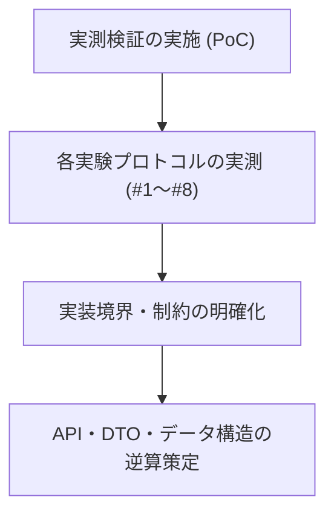

# 検証方法設計書（PoC・モデル境界評価計画）
**JEV 汎用判定基盤：モデル挙動・境界実測プロトコル**

| 項目 | 内容 |
| :--- | :--- |
| 文書番号 | JEV-TEST-001 |
| ドキュメント名 | JEV 検証方法設計書 |
| 版数 | Rev.1.1 (検証実験マトリクス拡充) |
| 改訂日 | 2026-09-20 |
| 作成日 | 2026-09-20 |
| 作成者 | JEV Architecture Team |

---

## 1. 検証の目的と基本アプローチ

### 1.1 検証目的（逆算型アプローチ）
本汎用基盤は、データ構造やAPIインターフェースを事前に固定化せず、**実測検証を通じて判明したモデル挙動と実装境界の制約から逆算して正式な仕様（DD/DS）を決定** します。

文章生成ループを行わない「Zero-Decode方式」が実際にどの程度の速度・メモリ効率・判定安定性・堅牢性を持つのかを、GitHub Issuesと紐づけた各実験プロトコルにより実測します。



---

## 2. 検証対象モデルと実験環境

### 2.1 比較対象モデル

| モデル識別名 | アーキテクチャ | パラメータ規模 | 主な検証観点 |
| :--- | :--- | :--- | :--- |
| **Candidate-A: DeBERTa-v3**<br>(`microsoft/deberta-v3-base` または `large`) | **Encoder-Only**<br>(双方向アテンション) | 86M〜435M | ・超高速レイテンシ<br>・極小VRAM消費<br>・NLU分類スコアの安定性 |
| **Candidate-B: Qwen2.5 / Gemma4 / Llama-3**<br>(`gemma4-12b`, `qwen2.5-coder:14b` 等) | **Decoder-Only**<br>(因果的アテンション) | 1.5B〜14B | ・世界知識・複雑な指示追従力<br>・単一Forward時の末尾Logit挙動<br>・思考プレフィックス制御 |

### 2.2 実験環境
- **OS**: Windows 11 (CUDA 12.x / NVIDIA RTX 3060 12GB)
- **ランタイム**: Python 3.11+ (`uv` 仮想環境)
- **バックエンド**: Ollama API (ローカルGGUF) / PyTorch Transformers

---

## 3. 検証実験マトリクス（8つの実験プロトコル）

各実験は GitHub Issues（#1〜#8）と1対1で対応し、検証スクリプトおよび結果ログを相互参照して管理します。

| 実験ID | 対応Issue | 検証テーマ | 目的・ゴール |
| :---: | :---: | :--- | :--- |
| **EXP-1** | **[#1](https://github.com/xzyozi/jev-localsystem/issues/1)** | **トークンID静的バインドと空白正規化** | 末尾空白有無（`" Yes"` vs `"Yes"`）によるIDズレ防止と安全な語彙セット確定 |
| **EXP-2** | **[#2](https://github.com/xzyozi/jev-localsystem/issues/2)** | **思考モデルのPrompt Prefill即時判定** | 空思考タグ事前注入によるCoTスキップ（**検証完了: 130ms達成**） |
| **EXP-3** | **[#3](https://github.com/xzyozi/jev-localsystem/issues/3)** | **Zero-Decode ベンチマーク実測** | 単一Forward vs 通常生成のレイテンシ・VRAM・バッチスループット比較 |
| **EXP-4** | **[#4](https://github.com/xzyozi/jev-localsystem/issues/4)** | **位置バイアス測定とスワップ検証** | A/B選択肢提示順序によるバイアスの発生率と順序反転（Swap）による相殺効果 |
| **EXP-5** | **[#5](https://github.com/xzyozi/jev-localsystem/issues/5)** | **マルチラベル判定（Sigmoid）の最適補正** | 生LogitへのSigmoid適用時の極値張り付き防止オフセットと最適閾値の探索 |
| **EXP-6** | **[#6](https://github.com/xzyozi/jev-localsystem/issues/6)** | **コンテキスト長限界（Lost in the middle）** | トークン長増加に伴うLogitマージン減衰測定と安全リミッター値の定義 |
| **EXP-7** | **[#7](https://github.com/xzyozi/jev-localsystem/issues/7)** | **Scoreタスク（期待値計算）のキャリブレーション** | 1〜5段階評価におけるLogit分布の滑らかさ確認と温度スムージング要否判定 |
| **EXP-8** | **[#8](https://github.com/xzyozi/jev-localsystem/issues/8)** | **シーケンシャルキュー・ストレステスト** | 同時巨大リクエスト時の直列キューイングによるVRAM枯渇（OOM）防止の実証 |

---

## 4. 各実験プロトコル詳細

### 実験1: トークンIDバインドと空白正規化の検証 (Issue #1)
- **検証内容**: プロンプト末尾を空白あり（`"回答: "`）と空白なし（`"回答:"`）の2パターンで入力し、ターゲット語彙（`"Yes"`, `" Yes"`, `"No"`, `" No"`）のトークンIDとLogit値を比較。
- **ゴール**: 末尾空白仕様とトークンIDが一意に対応し、Logitの逆転や不当な減衰が起きない静的バインド契約を確立。

### 実験2: 思考モデルのPrompt Prefill即時判定 (Issue #2)【検証完了】
- **検証内容**: Gemma4等の思考モデルに対し、空の思考完了タグ（`<thought>\n\n</thought>\n`）を事前注入（Prefill）し、1トークン目に直接判定を出力させる。
- **成果**: 思考文生成ループ（数秒〜十数秒）を完全回避し、約 **130ms** で `Yes` / `No` の即時判定に成功。

### 実験3: Zero-Decode ベンチマーク実測 (Issue #3)
- **測定メトリクス**: 処理時間 (ms)、最大消費VRAM (MB)、バッチ推論スループット (Batch Size = 1, 4, 8, 16)。
- **ゴール**: 生成型（.generate）との速度比・メモリ消費比を定量化。

### 実験4: 位置バイアス測定とスワップ検証 (Issue #4)
- **検証内容**: 案Aと案Bの提示順序を反転させたプロンプトでの推論を行い、反転率（Consistency Rate）を算出。
- **ゴール**: 単一Forwardでの位置バイアス度合いの把握とスワップ平均化アルゴリズムの有効性検証。

### 実験5: マルチラベル判定（Sigmoid）における最適オフセットと閾値探索 (Issue #5)
- **検証内容**:
  1. 正解データ（マルチラベル）を数十件流し込み、Sigmoid適用前の「Logitベースライン」を測定。
  2. 全体を0に近づける補正値（オフセット）と、F1スコア最大化しきい値（Threshold）を探索。
- **ゴール**: Sigmoid判定時のデフォルト設定値（オフセットと閾値）を確定。

### 実験6: コンテキスト長限界（Lost in the middle）に伴う確信度低下の検証 (Issue #6)
- **検証内容**:
  1. 入力テキスト長を 500, 1000, 2000, 4000 トークンと段階的に増加。
  2. ターゲットトークン（A, B, C）のLogitマージン（正解と不正解の差分）の減衰曲線をプロット。
- **ゴール**: 精度維持可能な「安全な最大トークン長（ソフトリミット）」を定義し、VRAM Managerのリミッター値に設定。

### 実験7: Scoreタスク（期待値計算）の分布とキャリブレーション検証 (Issue #7)
- **検証内容**:
  1. 明らかな「1」、明らかな「5」、グレーゾーン「3」のデータを与え、期待値計算の結果を記録。
  2. 極端な回答（1か5）への偏りや中間Logitの潰れ現象が発生していないか確認。
- **ゴール**: 極端値への偏りがある場合、Temperature（温度パラメータ）によるスムージング処理の実装要否を判断。

### 実験8: シーケンシャルキュー・ストレステスト (Issue #8)
- **検証内容**:
  1. 最大コンテキスト長の巨大リクエストを同時に10件非同期でAPIに投入。
  2. キューイング制御（直列処理）が正しく働き、OOMを起こさず安定完了するか検証。
- **ゴール**: ローカル環境における耐久性・リソース保護契約の確立。

---

## 5. 検証スクリプトとログの配置規約

```text
scripts/
├── verify_ollama_gemma.py              # 基礎検証スクリプト
├── verify_gemma_thinking_suppress.py   # Issue #2 検証スクリプト
├── benchmark_zero_decode.py            # Issue #3 検証スクリプト (予定)
├── verify_position_bias.py             # Issue #4 検証スクリプト (予定)
├── verify_multilabel_sigmoid.py        # Issue #5 検証スクリプト (予定)
├── verify_context_decay.py             # Issue #6 検証スクリプト (予定)
├── verify_score_calibration.py         # Issue #7 検証スクリプト (予定)
└── test_sequential_queue.py            # Issue #8 検証スクリプト (予定)

docs/logs/
├── 20260920_gemma_thinking_suppress_verification.md  # Issue #2 検証レポート
└── ...
```

---

## 6. 改訂履歴 (Change Log)

| 版数 | 改訂日 | 変更者 | 変更内容・変更理由 (Why) |
| :--- | :--- | :--- | :--- |
| Rev.1.0 | 2026-09-20 | JEV Architecture Team | 新規作成（初版制定：PoC実験計画の策定） |
| Rev.1.1 | 2026-09-20 | JEV Architecture Team | 実験マトリクス拡充（Issue #1〜#8 に完全連動：Sigmoid補正、コンテキスト長限界、Score分布、耐久テスト等の追加） |
